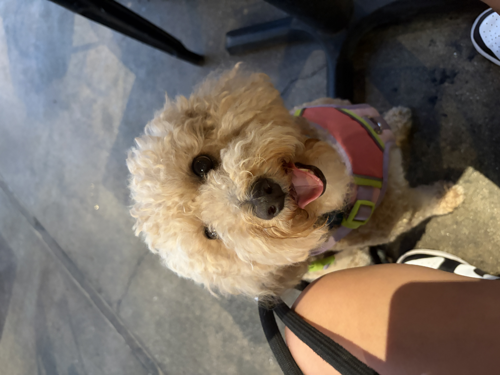

# **Bethany Miyamoto**

## User Page

### About Me

- 2nd year CS major
- Seventh College
- 19 years old
- I have two dogs (insert image here)
  - Oliver

  - Aslan

### Programming Specifics

### Favorite Quote

> Alex, do not interrupt me when I'm daydreaming. If a zebra's in the zone, leave him alone. - Marty
> Life is more manageable when thought of as a scavenger hunt as opposed to a surprise party - Mozzie
> If there were more food and fewer people, this would be a perfect party - Ron Swanson

### Wish List

- [ ] Digital camera
- [ ] Hirono or smiski
- [ ] Bracelet
- [ ] Polaroid film
- [ ] PC
- [ ] Gaming mouse

### How I Made This Page

1. Write the headers  using the `#` symbol
2. Style the pages  
3. Add details such as bold `** **` or quotes using `>`
4. For more documentation details, look at [Markdown](https://docs.github.com/en/get-started/writing-on-github/getting-started-with-writing-and-formatting-on-github/basic-writing-and-formatting-syntax#links)  

### *Links to the Sections*

Link to User Page: [Link Text](#user-page)
Link to About Me: [Link Text](#about-me)
Link to Programming Specifics: [Link Text](#programming-specifics)
Link to Favorite Quote: [Link Text](#favorite-quote)
Link to Wish List: [Link Text](#wish-list)
Link to How I Made This Page: [Link Text](#how-i-made-this-page)

[The README.md file has more information](README.md)  
